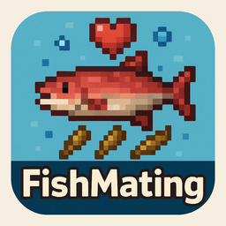

# 🐠 FishMating Plugin
> Bring your underwater world to life by letting fish breed naturally when players throw seeds into water! 🌊✨



---

## 📦 Overview

**FishMating** is a feature-rich and highly configurable Minecraft plugin designed for **1.21.3+**. Crafted with ❤️ by `mrsuffix`, this plugin brings your aquatic biomes to life by introducing a unique, seed-based fish breeding mechanic.

Throw seeds into water to attract nearby fish! Fish will detect matching seeds within a **5-block radius**, swim toward them, and become *breeding-ready* after consuming a seed. If two ready fish find each other within **30 seconds**, they breed and spawn a cute baby fish 🐣. After breeding, fish wait **3 minutes** before breeding again.

Every detail can be customized in the `config.yml` — from detection radius to particles, cooldowns, and seed mappings! ⚙️

---

## ✨ Features

✅ Works with Minecraft **1.21.3+**  
✅ Attract fish by throwing seeds into water 🌱  
✅ Fully configurable detection radius, cooldowns, particles, and more  
✅ Heart particles show breeding readiness ❤️  
✅ Supports four fish types by default:  
- Salmon 🐟 ← *Wheat Seeds* 🌾  
- Cod 🐠 ← *Pumpkin Seeds* 🎃  
- Pufferfish 🐡 ← *Melon Seeds* 🍉  
- Tropical Fish 🐠 ← *Beetroot Seeds* 🥬  

✅ Advanced controls: debug logging, max tracked fish, breeding success chance  
✅ Clean, modern multi-class code structure and JavaDocs 🛠️  
✅ Compatible with other popular plugins  
✅ Graceful handling of edge cases to keep your console error-free 🚀

---

## ⚙️ Configuration

Here’s an example `config.yml` with full customization options:

```yaml
# FishMating Plugin Configuration
# Author: mrsuffix
# Version: 1.0.0

settings:
  detection-radius: 5.0
  breeding-timeout-seconds: 300
  breeding-cooldown-minutes: 3
  enable-particles: true
  particle-count: 5

fish-mappings:
  salmon: wheat_seeds
  cod: pumpkin_seeds
  pufferfish: melon_seeds
  tropical_fish: beetroot_seeds

advanced:
  debug-logging: false
  max-tracked-fish: 1000
  natural-growth: true
  breeding-success-rate: 1.0
````

Everything from detection range to particle effects and breeding logic can be tweaked! 🎛️

---

## 🛠 Installation

1️⃣ Download the latest **FishMating.jar** from the [Releases](https://github.com/YourUsername/FishMating/releases) tab.
2️⃣ Place it in your server's `/plugins` folder.
3️⃣ Restart or reload your server.
4️⃣ Edit the `config.yml` to fit your server’s style!
5️⃣ Enjoy dynamic underwater life! 🌊🐟

---

## 📂 Project Structure

```
FishMating/
├── src/
│   ├── main/java/com/mrsuffix/fishmating/
│   │   ├── FishMating.java          # Main plugin class
│   │   ├── listeners/               # Event listeners
│   │   ├── managers/                # Logic and tracking
│   │   └── utils/                   # Helper classes
├── resources/
│   ├── plugin.yml
│   └── config.yml
└── README.md
```

Well-documented and clean to help new developers understand and contribute! 🧰

---

## 📜 License

This plugin is open-source under the **MIT License**.
Feel free to use, modify, and share! 🤝

---

## ✏️ Author

Developed with ❤️ by **mrsuffix**

> GitHub: [mrsuffix](https://github.com/mrsuffixx)

---

## ⭐ Support the Project!

If you enjoy **FishMating**, leave a ⭐ on the repository!
Your support helps keep the project alive and encourages new updates! 🚀✨

---

## 🌊 Bring life to your oceans!

FishMating makes your aquatic world dynamic, fun, and interactive.
Perfect for survival servers, creative builds, and roleplay worlds alike.
Make your underwater biomes feel truly alive! 🐟❤️🌱

```
